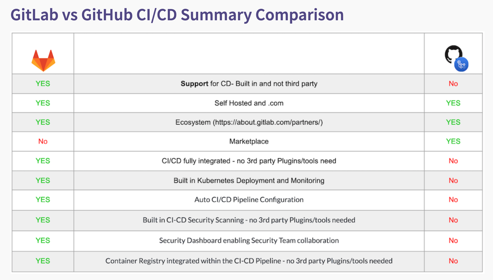
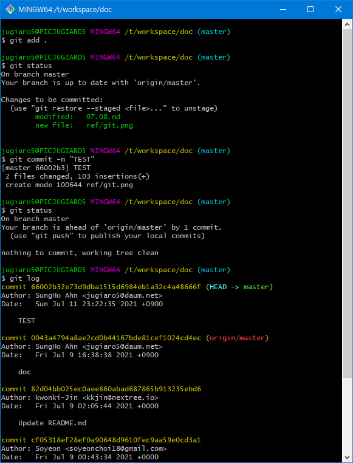

# 21.07.08 (목)

| R    | W    | C    | LoC  |
| ---- | ---- | ---- | ---- |
| 20   | 120  | 0    | 0    |

> 노트북을 받지 않은 상태임에 필요한 내용 학습

--------

# 형상 관리 도구란?

형상 관리 도구는 대표적으로 SVN, GIT이 존재한다.

## SVN

- 중앙 저장소 기반
- 중앙에 통합된 원격 서버를 두고 각자 컴퓨터의 사본들의 충돌 여부를 통합해서 관리한다.
- 사용하기 직관적이나 한 멤버의 수정작업이 끼치는 영향도가 커 충돌 확률이 높다.

## GIT

- 분산 독립 저장소(분산 버전 관리 시스템)
- 소스 코드의 변경 이력을 저장 및 파일을 관리해주는 시스템

## Github

- 공개적으로 사용 가능한 무료 서비스로 모든 코드를 공개해야한다.
- **오픈 소스 역할**
- git을 사용하는 프로젝트를 지원하는 웹 호스팅 서비스, 웹 사이트, 플랫폼, 원격 클라우드 저장소이다.

## GitLab

- 개인 또는 조직이 Git Repository의 내부 관리를 제공하는데 사용할 수 있는 github로 비공개된 github라고 할 수 있다.

	

## 로컬 / 원격 저장소

### 1. 로컬(local) 저장소

>  자신의 컴퓨터에 있는 저장소

### 2. 원격(remote) 저장소

>  서버 등의 네트워크에 있는 저장소

- 기본 설정된 원격 저장소 주소에는 **origin**이라는 별명을 붙인다.

### 3. 흐름

>  로컬 저장소에서 작업을 수행하고, 그 결과를 원격 저장소에 저장한다.

## 기본 명령어

### 1. git init 

> git 저장소 생성

- .git 폴더 생성
- config 파일 보유, 별도 설정이 없다면 git config --global 정보 사용

### 2. git remote

- git remote

  >  원격 저장소 이름 목록

- git remote add origin [원격 주소]

  >  로컬 저장소와 원격 저장소 연결

- git remote -v

  >  원격 저장소 연결 확인

### 3. git add

>  인덱스에 파일 추가

- git 저장소(repository)는 3가지 구성

  - 작업 트리(Working directory) > 인덱스(Staging Area) > 저장소(Head-Repository)

    

	    

    

- 작업 트리(Working directory): 우리가 작업하는 폴더

- 인덱스(Stagin Area): commit 전, 작업 트리와 저장소 사이에 존재하는 가상의 준비 영역

- 저장소에 commit 하기 위해, 먼저 **추가(Untracked files) 및 변경(Modified files)하고자 하는 파일을 먼저 인덱스에 기록(Stage)**하고 기록한 목록만 최종적으로 commit에 의해 저장소에 공개된다.

### 4. git commit

> 변경 사항 확정

- git commit -a

  > -a: add와 commit을 동시에 하는 옵션

### 5. git push

- git push -u origin master

> 로컬 저장소에서 원격 저장소로 push

> -u: 로컬 저장소 master 브랜치를 원격 저장소 master 브랜치에 연결 옵션

### 6. TEST

	

- 66002b32e73d9dba1515d6984eb1a32c4a48666f 값은 commit할 때, SHA-1해시를 사용하여 만들어진 **40자 길이의 16진수 체크섬(hash) 데이터**로, git에서 사용하는 가장 기본적인 원자 데이터이다.

-------

# 자바 프로그램 실행 과정

	

## 자바 컴파일러

자바를 가지고 작성한 자바 소스 코드를 자바 가상 머신이 이해할 수 있는 자바 바이트 코드로 변환한다.

자바 컴파일러는 자바를 설치하면 javac.exe라는 실행 파일 형태로 설치된다.

## 자바 바이트 코드

자바 가상 머신이 이해할 수 있는 언어로 변환된 자바 소스 코드를 의미한다.

자바 컴파일러에 의해 변환되는 코드의 명령어 크기가 1바이트라서 자바 바이트 코드라고 불리고 있다.

이러한 자바 바이트 코드의 확장자는 .class 이다.

자바 바이트 코드는 자바 가상 머신만 설치되어 있으면, 어떤 OS에서도 실행될 수 있다.

## 자바 가상 머신(JVM)

자바 바이트 코드를 실행시키기 위한 가상의 기계이다.

자바로 작성된 모든 프로그램은 자바 가상 머신에서만 실행될 수 있으므로, 자바 프로그램을 실행하기 위해서는 반드시 자바 가상 머신이 설치되어 있어야 한다.

### 자바 가상 머신의 구성

1. 자바 인프리터(interpreter)
   - 자바 컴파일러에 의해 변환된 자바 바이트 코드를 읽고 해석하는 역할
2. 클래스 로더(class loader)
   - 자바는 동적 클래스를 읽어오므로, 프로그램이 실행 중인 런타임에서야 모든 코드가 자바 가상 머신과 연결된다.
   - 이렇게 동적으로 클래스를 로딩해주는 역할을 한다.
3. JIT 컴파일러(Just-In-Time compiler)
   - 프로그램이 실행 중인 런타임에 실제 기계어로 변환해 주는 컴파일러를 의미한다.
   - 동적 번역(dynamic translation)이라고도 불리며, 프로그램의 실행 속도를 향상시키기 위해 개발되었다.
   - 즉, 자바 컴파일러가 생성한 자바 바이트 코드를 런타임에 바로 기계어로 변환하는 데 사용한다.
4. 가비지 컬렉터(garbage collector)
   - 더는 사용하지 않는 메모리를 자동으로 회수해준다.

#### 참조

https://parkadd.tistory.com/20

https://mozi.tistory.com/430
