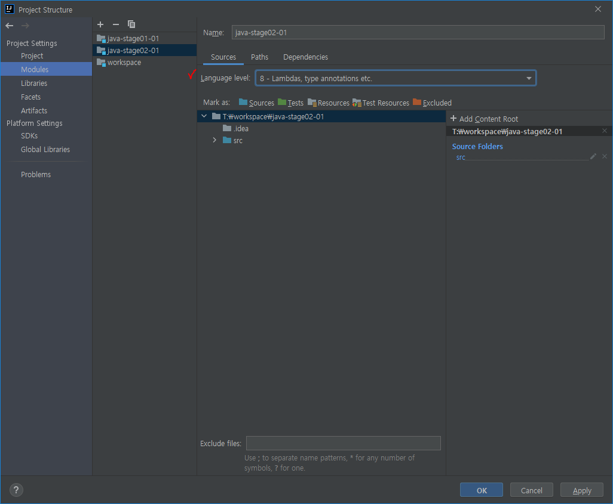

# 07.12 (월)

| R    | W    | C    | LoC                                                          |
| ---- | ---- | ---- | ------------------------------------------------------------ |
| 30   | 20   | 400  | :o: java-stage01-02: 743<br>:o: java-stage01-03: 735<br>java-stage02-01: 672<br>total: 2150 |


## 인텔리제이 폴더

### 1. out 폴더

> 인텔리제이 빌드 시에 컴파일한 class를 저장하는 폴더

### 2. build 폴더

> gradle 빌드 시에 컴파일한 class를 저장하는 폴더


## 인텔리제이 오류

java: error: invalid source release: n

<center>
	<p align="center"></p>
</center>

- Language Level을 자신의 JDK와 맞추자.


# 정규표현식

- java.util.regex 패키지 내에 3가지 클래스

  - Pattern 클래스

    > 정규표현식에 대상 문자열을 **검증**할 때 사용 (주로 matches() 메서드)

  - Matcher 클래스

    > 대상 문자열의 패턴을 해석하고 **주어진 패턴과 일치하는지 판별**할 때 사용

  - PatternSyntaxException 클래스


### 1. Pattern 클래스의 주요 메서드

- compile(String regex)

  > 주어진 정규 표현식으로부터 패턴을 만든다.

- matcher(CharSequence input)

  > 대상 문자열이 패턴과 일치할 경우 true를 반환한다.

- asPredicate()

  > 문자열을 일치시키는데 사용할 수 있는 술어를 작성한다.

- pattern()

  > 컴파일된 정규표현식을 String 형태로 반환한다.

- split(CharSequence input)

  > 문자열을 주어진 인자값 CharSequence 패턴에 따라 분리한다.


### 2. Matcher 클래스의 주요 메서드

- matches()

  > 대상 문자열과 패턴이 일치할 경우 true 반환한다.

- find()

  > 대상 문자열과 패턴이 일치하는 경우 true 반환하고, 그 위치로 이동한다.

- find(int start)

  > start 위치 이후부터 매칭 검색을 수행한다.

- start()

  > 매칭되는 문자열 시작 위치를 반환한다.

- start(int group)

  > 지정된 그룹이 매칭되는 시작 위치를 반환한다.

- end()

  > 매칭되는 문자열 끝 다음 문자 위치를 반환한다.

- end(int group)

  > 지정된 그룹이 매칭되는 끝 다음 문자 위치를 반환한다.

- group()

  > 매칭된 부분을 반환한다.

- group(int group)

  > 매칭된 부분 중 group번 그룹핑 매칭 부분을 반환한다.

- groupCount()

  > 패턴 내 그룹핑한(괄호 지정) 전체 갯수를 반환한다.


### 3. 정규표현식 문법

| 정규표현식 | 설명                                                         |
| ---------- | ------------------------------------------------------------ |
| ^          | 문자열 시작                                                  |
| $          | 문자열 종료                                                  |
| .          | 임의의 한 문자 (단 \은 넣을 수 없음)                         |
| *          | 앞 문자가 없을 수도 무한정 많을 수도 있음                    |
| +          | 앞 문자가 하나 이상                                          |
| ?          | 앞 문자가 없거나 하나 있음                                   |
| [ ]        | 문자의 집합이나 범위를 나타낸다.<br>두 문자 사이 - 기호는 범위<br>^ 기호는 not을 의미한다. |
| { }        | 횟수 또는 범위를 나타낸다.                                   |
| ( )        | 소괄호 안의 문자를 하나의 문자로 인식                        |
| \|         | 패턴 안에서 or 연산을 수행할 때 사용                         |
| \          |                                                              |

```java
import java.util.ArrayList;
import java.util.List;
import java.util.regex.Matcher;
import java.util.regex.Pattern;

public class regex {

    public static void main(String[] args) {

        // 1. Pattern 클래스
        String pattern = "^[0-9]*$"; // 숫자만
        String val = "123456789"; // 대상 문자열

        boolean regex = Pattern.matches(pattern, val);
        System.out.println(regex);

        // 2. Matcher 클래스
        Pattern pattern2 = Pattern.compile("^[a-zA-Z]*$"); //영문자만
        String val2 = "abcdef"; //대상문자열

        Matcher matcher = pattern2.matcher(val);
        System.out.println(matcher.find());

        // 유효성 검사
        String name = "홍길동";
        String tel = "010-1234-5678";
        String email = "test@naver.com";

        //유효성 검사
        boolean name_check = Pattern.matches("^[가-힣]*$", name);
        boolean tel_check = Pattern.matches("^01(?:0|1|[6-9])-(?:\\d{3}|\\d{4})-\\d{4}$", tel);
        boolean email_check = Pattern.matches("\\w+@\\w+\\.\\w+(\\.\\w+)?", email);

        //출력
        System.out.println("이름 : " + name_check);
        System.out.println("전화번호 : " + tel_check);
        System.out.println("이메일 : " + email_check);


    }
}

```

