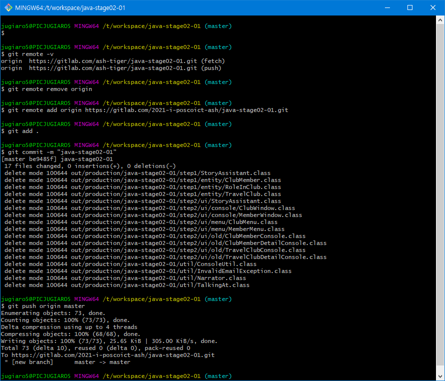
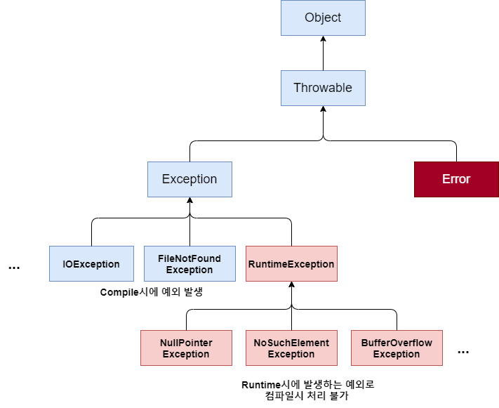

# 07.13 (화)

| R    | W    | C    | LoC  |
| ---- | ---- | ---- | ---- |
| 30   | 30   | 400  | 1953 |

# :star: git remote

- origin

  > 별칭(alias)의 일종으로, remote한 repository(URL)를 의미한다.

- git remote -v

  > remote한 repository를 볼 수 있다.

- git remote remove origin

  > remote 제거

    

# :star: Exception

## 예외란?

> error의 일종으로 프로그램 수행 또는 컴파일시에 블능 상태를 만들어 버린다.

## 예외 처리란?

> Exception 예외가 발생할 것을 대비하여 미리 예측해 이를 소스상에서 제어하고 처리하도록 만든 것이다.

## 예외의 종류

### 1. Exception(일반 예외)

> 컴파일 시점에 발생하는 예외

### 2. RuntimeException(실행 예외)

> 프로그램 실행 시에 발생하는 예외

### Exception 클래스

    

- 모든 예외는 Exception 클래스를 상속받는다.

## try-catch-finally문

### 1. try 블록

- 예외가 발생할만한 코드 작성

### 2.  catch 블록

- 예외가 발생되었을 때 처리하는 동작을 명시
- 주의! catch가 여러 개를 사용할 때, 가장 낮은 자식 예외 클래스를 먼저 작성
- 상위 catch가 실행되면, 이후 catch는 검사하지 않는다.

### 3. finally 블록

- 예외가 발생하건 발생하지 않건 공통으로 수행되어야할 코드 작성

## throw

예외를 강제로 발생시키는 것

> throw new [발생시킬 예외];

## throws

예외를 던지다.

> 예외를 여기서 처리하지 않을테니, 나를 불러다가 쓰는 녀석에게 에러 처리를 전가하겠다는 의미이다.

참조

https://bvc12.tistory.com/196?category=551930

