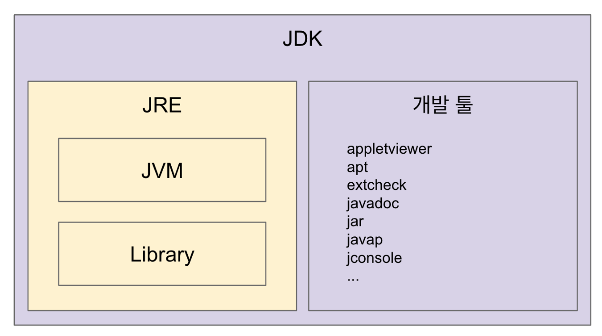
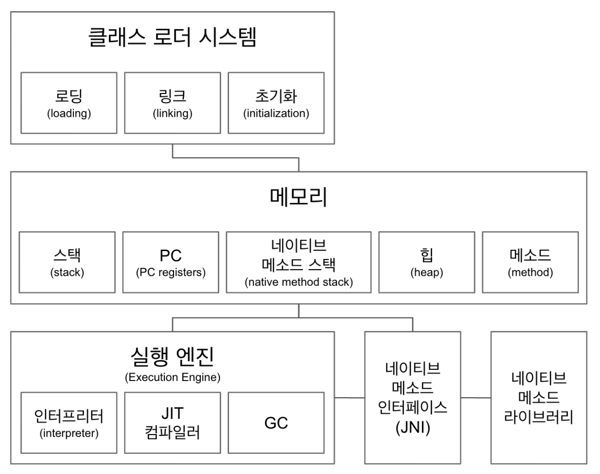
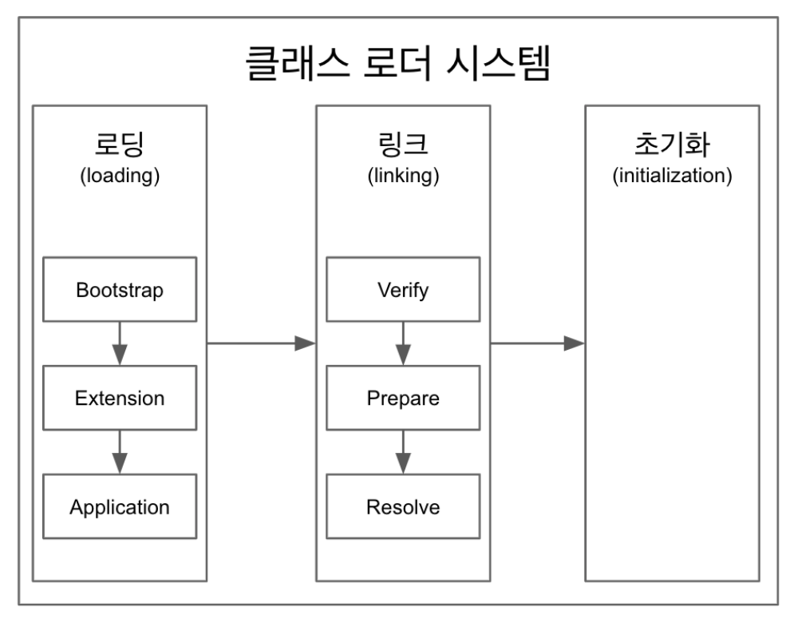

# 07.14 (수)

| R    | W    | C    | LoC                                                   |
| ---- | ---- | ---- | ----------------------------------------------------- |
| 30   | 60   | 400  | :o: java-stage02-01 -> 501 java-stage02-02 -> 1403 |

### final 변수란?

> 변수를 상수화 시킨다. 즉 하번 값이 결정된 변수의 값은 변경이 불가능하다.

### final 클래스란?

> 클래스를 final로 선언한다면, 이 클래스를 상속하는 것을 허용하지 않겠다라는 의미이다.

> 대표적으로 String 클래스

### final 메서드란?

> 메서드의 오버라이딩을 허용하지 않겠다라는 의미이다. 클래스는 상속이 가능하되 해당 메서드는 오버라이딩이 불가능하다.

### static 변수란?

> 메모리 공간에 하나만 존재하며, 어디서나 접근이 가능한 변수이다.

> 어디서나 접근이 가능하려면 static 변수도 public으로 선언되어야 한다.

### static 변수 초기화 시점

- 인스턴스가 생성되기 이전에 별도의 메모리 공간에 할당되어 초기화까지 완료된다.
- 초기화되는 시점은 JVM에 의해 클래스가 메모리 공간에 올라가는 순간이다.

### static 변수 사용 이유

- 인스턴스 간에 데이터 공유가 필요한 상황에서 static 변수를 선언한다.

### static final 선언

- 클래스 내부 또는 외부에서 참조의 용도로만 선언된 변수는 static final로 선언한다.

### static 메서드란?

- 인스턴스를 생성하지 않아도 static 메서드를 호출할 수 있다.
- 사용 이유는 객체를 생성할 필요가 없는 메서드에 붙인다. 인스턴스 변수에 접근하지 않는다면 static 메서드로 정의해야 한다.

### public static void main

- main 메서드는 인스턴스의 생성과 관계없이 JVM에 의해 호출이 되므로 반드시 static으로 선언해야 한다.

    

### JVM(Java Virtual Machine)

- .class 파일을 OS에 맞는 machine code로 변환 (인터프리터 & JIT 컴파일러)
- 플랫폼(OS)에 종속적

### JRE(Java Runtime Environment)

- JVM + 핵심 라이브러리
- 개발 관련 x 실행 관련 o
- java는 보통 JRE 단위로 배포된다.

### JDK(Java Development Kit)

- JRE + 개발툴(java c)

### Java

- 소스코드 자체는 플랫폼에 독립적
- javac에 의해 .class로 만들어짐
- JVM 자체 연관이 타이트하지 않다.
- .java > (javac) > .class > (jvm) > process

### Byte 코드와 Binary 코드의 차이

- Byte 코드는 JVM 같은 가상 머신이 이해할 수 있는 코드 (.class)
- Binary 코드는 CPU가 이해할 수 있는 코드

    

### 클래스 로더 시스템

- 바이트 코드를 읽어오며 메모리에 적절히 배치하는 역할
- 로딩
  - .class를 읽어온다.
- 링크
  - 코드 내부의 레퍼런스를 연결한다.
- 초기화
  - 클래스에 있는 static 값들을 초기화한다.

### 메모리

전체 공유 자원(힙, 메서드) / 쓰레드 단위 자원(스택, PC, 네이티브 메서드 스택)으로 분류된다.

- 메서드
  - 클래스 수준의 정보를 저장한다.
    - 클래스 이름, 부모 클래스 이름, 메서드, 변수 등
    - static 변수, 일반 변수 등
- 힙
  - 객체(인스턴스) 수준의 정보를 저장한다.
- 스택
  - 인스턴스 및 지역변수의 참조 주소들을 저장한다.
  - 쓰레드마다 런타임 스택을 만들고, 스택 프레임(메서드 call)을 쌓는다.
    - 에러가 났을 때, 에러 메시지보면 런타임 스택에 메시지 쌓여있는 것을 확인할 수 있다.
- PC
  - 쓰레드마다 가지고 있는 Program Counter
  - 현재 실행할 부분을 가리키고 있다.
- 네이티브 메서드 스택
  - 네이티브 메서드 호출할 때 사용하는 별도의 스택
  - 네이티브 메서드는 java가 아닌 c와 같은 언어(low-level)로 구현된 메서드이다.
    - 대표적인 예시로 Thread.currentThread()

### 실행엔진

- 인터프리터
  - 바이트 코드를 한줄한줄 읽어서 네이티브 코드로 변환한다.
- JIT(Just In Time) 컴파일러
  - 바이트 코드에서 반복되는 코드 부분은 JIT 컴파일러가 미리 네이티브 코드로 변환 시켜 놓는다.
  - 반복되는 코드가 읽힐 순서가 왔을 때, 인터프리터로 읽지 않고 바로 네이티브 코드를 바로 사용한다.
  - 인터프리터 읽을 때의 속도 효율성을 JIT 컴파일러가 보완하는 형태
- GC(Garbage Collector)
  - 더 이상 참조되지 않는 객체를 모아서 메모리 정리를 한다.
  - 경우에 따라 성능 효율을 위해 커스터마이징을 해야한다.

    

로딩 -> 링크 -> 초기화 순으로 진행된다.

- 로딩
  - .class 파일을 읽어서 바이트 코드 -> 바이너리 코드로 만들고 이를 "메서드"영역에 저장한다.
  - 저장하는 데이터는 다음과 같다.
    - Fully-Qualified Class Name
      - 클래스 로더, 클래스 패키지 경로, 패키지 이름, 클래스 이름을 모두 포함한 값
      - ex) java.lang.Character&Subset
    - 클래스 | 인터페이스 |enum을 구분하여 저장
    - 메서드와 변수
  - 로딩이 끝나면 해당 클래스 타입의 객체를 생성하여 "힙"영역에 저장한다.
  - Bootstrap -> Extention -> Application Loader 순으로 앞의 Loader가 로딩할 수 없으면 그 다음 Loader가 읽어내는 식
- 링크
  - Verify
    - .class 파일 형식이 유요한지 검사한다.
  - Prepare
    - static 변수와 기본 값에 필요한 메모리를 준비한다.
  - Resolve(Optional)
    - 심볼릭 메모리 레퍼런스를 실제 메모리 레퍼런스로 교체한다.
    - Optional인 이유는, 이 때 교체(binding)될 수도 있고, 이후 사용이 일어날 때에 동작으로 교체될 수 있다.
- 초기화
  - static 변수를 초기화한다.