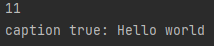

# 07.15 (목)


# 클래스의 관계

1. 상속
2. 포함


# 1. 상속

- 어떤 클래스가 다른 클래스의 멤버변수와 멤버함수를 물려받는 것
- 상속을 사용하는 이유: 코드를 **재사용**하기 위해서


- class 자식클래스 extends 부모클래스 {}
- 자손은 조상의 모든 멤버를 상속받는다. (생성자, 초기화 블럭 제외)
- 자손의 멤버 개수는 조상보다 적을 수 없다. (같거나 많다)
- 자손의 변경은 조상에 영향을 미치지 않는다.


- 장점
  - 기존 클래스의 필드와 메서드를 재사용
  - 기존 클래스의 일부 변경도 가능
  - 복잡한 GUI 프로그램을 순식간에 작성
  - 이미 작성된 검증된 소프트웨어을 재사용
  - 신뢰성 있는 소프트웨어를 손쉽게 개발, 유지보수
  - 코드의 중복을 줄일 수 있다.


```java
class Tv{
    boolean power;
    int channel;

    void power(){
        power = !power;
    }

    void channelUp(){
        ++channel;
    }

    void channelDown(){
        --channel;
    }
}

class SmartTv extends Tv{
    boolean caption;

    void displayCaption(String text){
        if(caption){
            System.out.println(text);
        }
    }
}
public class 상속 {

    public static void main(String[] args) {
        SmartTv stv = new SmartTv();
        stv.channel = 10;
        stv.channelUp();;
        System.out.println(stv.channel);

        stv.displayCaption("caption false: Hello world");
        stv.caption =true;
        stv.displayCaption("caption true: Hello world");
    }
}

```

<center>
    
</center>


# 2. 포함

- 클래스의 멤버로 참조변수를 선언하는 것
- 작은 단위의 클래스를 만들고, 이 들을 조합해서 클래스를 만든다.

```java
class MyPoint {
    int x;
    int y;
}

// 1. 상속 관계
class Circle extends MyPoint {
    int r;
}

// 2. 포함 관계
class Circle2 {
    MyPoint p = new MyPoint();
    // MyPoint p : 클래스의 멤버로 참조변수(다른 클래스 타입의 변수)를 선언하고
    // new MyPoint() : 타입의 객체를 만들어 주는 것
    int r;
}

public class test02_포함 {
    public static void main(String[] args) {
        // 1. 상속 관계
        Circle c = new Circle();
        c.x = 1;
        c.y = 2;
        c.r = 3;
        System.out.println("x: " + c.x);
        System.out.println("y: " + c.y);
        System.out.println("r: " + c.r);

        // 2. 포함 관계
        Circle2 c2 = new Circle2();
        c2.p.x = 1;
        c2.p.y = 2;
        c2.r = 3;
        System.out.println("x: " + c2.p.x);
        System.out.println("y: " + c2.p.y);
        System.out.println("r: " + c2.r);
    }
}

```


# 3. 상속 vs 포함

- 상속 관계: ~은 ~이다. (is - a)
- 포함 관계: ~은 ~을 가지고 있다. (has - a)


# 4. 단일 상속

- 자바는 단일상속만 허용한다. (C++은 다중상속 허용)
- 그래서 이를 해결하는 것이 인터페이스


- 단일상속이란?

  >  하나의 부모만 상속한다는 것


- 인터페이스를 사용하지 않고 다중상속 효과를 내는 법

  > 비중이 높은 클래스 하나만 상속관계로 나머지는 포함관계로 한다.


- Object 클래스

  > 모든 클래스의 조상

  - 부모가 없는 클래스는 자동으로 Object 클래스를 상속받게 된다.
  - 모든 클래스는 Object 클래스에 정의된 11개의 메서드를 상속받는다
    - ex) toString(), equals(Object obj), hasCode(), ...


# 5. Override

- 오버라이딩이란?

  > 상속받은 조상의 메서드를 자신에 맞게 변경하는 것


- 조건
  - 선언부 (반환 타입, 메서드 이름, 매개변수 목록)가 조상 클래스의 메서드와 일치해야 한다.
  - 접근 제어자를 조상 클래스의 메서드보다 좁은 범위로 변경할 수 없다.
  - 예외는 조상 클래스의 메서드보다 많이 선언할 수 없다.


# 6. Overloading

- 오버로딩이란?

  > 한 클래스 안에 같은 이름의 메서드 여러 개 정의하는 것


- 성립 조건 3가지
  - 메서드 이름이 같아야 한다.
  - 매개변수의 개수 또는 타입이 달라야한다.
  - 반환타입은 영향없다.


# 7. Override vs Overloading

- 오버라이딩: 상속받은 메서드의 내용을 변경하는 것 (change, modify)
- 오버로딩: 기존에 없는 새로운 메서드를 정의하는 것 (new) (상속과 전혀 관계 없는 것, 이름만 비슷)


# 8. 생성자 this()

- 생성자에서 다른 생성자 호출할 때 사용


# 9. 참조변수 this

- this()와 this는 전혀 다른 개념


- 인스턴스 자신을 가리키는 참조변수
- 인스턴스 메서드(생성자 포함)에서 사용 가능
- 지역변수와 인스턴스 변수를 구별할 때 사용


#### 참고) 변수의 종류

| 변수의 종류         | 선언 위치                                       | 생성시기(메모리 할당 시기)  |
| ------------------- | ----------------------------------------------- | --------------------------- |
| 클래스 변수(static) | 클래스 영역                                     | 클래스가 메모리에 올라갈 때 |
| 인스턴스 변수       | 클래스 영역                                     | 인스턴스가 생성될 때        |
| 지역 변수           | 클래스 이외의 영역(메서드, 생성자, 초기화 블럭) | 변수 선언문이 수행되었을 때 |

※ 멤버 변수 (클래스 변수와 인스턴스 변수 포함): 선언 위치가 클래스 영역


- 클래스 변수
  - 인스턴스 변수에 static 붙인 것.
  - 인스턴스 변수는 각각 고유한 값 but, 클래스 변수는 모든 인스턴스가 공유하는 공통된 값
  - 그러므로 클래스 로딩될 때 생성되어(메모리에 딱 한번 올라감) 종료 될 때까지 유지되는 클래스 변수는 public을붙이면 같은 프로그램 내에서 어디서든 접근 가능한 전역변수가 된다.
  - [클래스이름].[클래스변수명] 으로 접근 가능


- 인스턴스 변수
  - 인스턴스가 생성될 때 생성되므로 인스턴스 변수의 값을 읽어오거나 저장하려면 인스턴스를 먼저 생성해야한다.


- 지역 변수
  - 메서드 내에서 선언되며 메서드 내에서만 사용할 수 있는 변수
  - 메서드가 실행될 때 메모리를 할당 받으며 메서드가 끝나면 소멸되어 사용할 수 없게 된다.


```java
class value{
    int iv; // 인스턴스 변수
    static int cv; // 클래스 변수
    
    void method(){
        int lv; // 지역 변수
    }
}
```


# 10. 참조변수 super

- 참조변수 this: 지역변수와 인스턴스를 구별할 때 사용


- 참조변수 super: 조상 멤버 변수, 자신의 멤버 변수를 구별할 때 사용